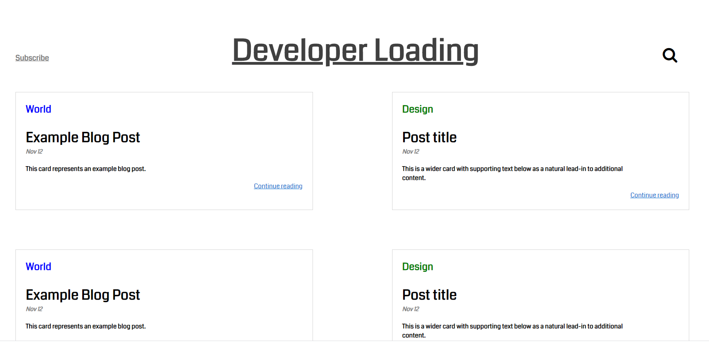
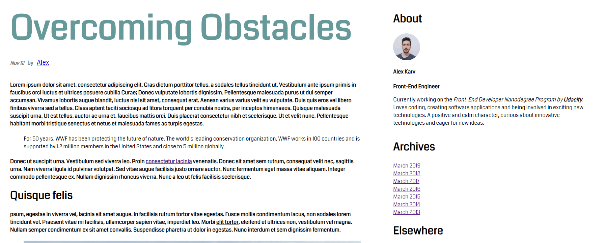

# Blog-Site
An example of a simple blog designed from scratch as a part of Udacity's Front-End Nanodegree program.

## Built With

* HTML
* CSS
* Javascript

### Installing
Just clone/download the project files, and run index.html at your browser of choice.

## Homepage 

## Post example 

## Authors

Alex Karvounis - [al3xkarv](https://github.com/al3xkarv)

## License

This project is licensed under the GNU General Public License v3.0

